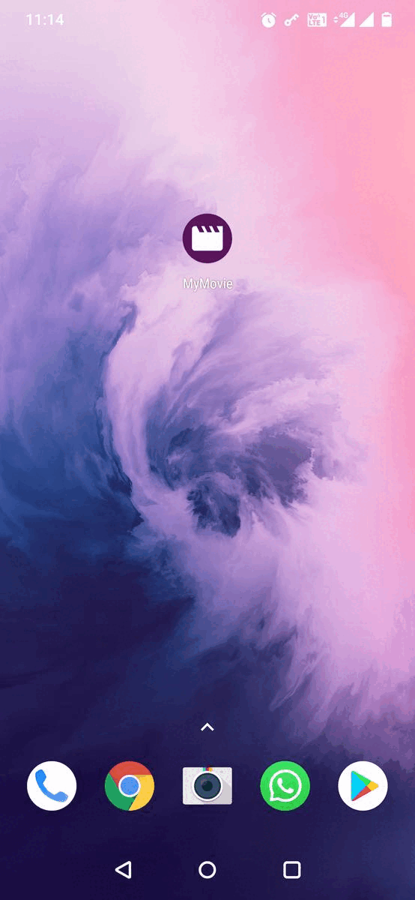

# My Movie App

My Movie is a simple App to explore and watch movie trailers according to categories.
 

### Features
---
- Watch movie trailer & details.
- Search movie & get movie details according to categories.

### Application Architecture
---
- IDE: Android Studio
- Programming Language: Kotlin
- Architecture: MVVM
- Third Party Libraries: Coroutines, Flow, DaggerHilt, Navigation Component, Retrofit, Moshi, Glide, YoutubePlayer,
  Circle Imageview

 

## 🚀 Learning Tips:
 Main Purpose to create project to understand the use case of MediatorLiveData with Navigation Component & DaggerHilt using MVVM architecture design pattern.

 Let’s get understand.

 ### Why we use MediatorLiveData
 MediatorLiveData can observe other LiveData objects such as sources and react to their onChange() events.
 let's discussed with scenario, we have 2 instances of LiveData, let's name them liveData1 and liveData2, and we want to merge their
 emissions in one object liveDataMerger. Then, liveData1 and liveData2 will become sources for the MediatorLiveData liveDataMerger and
 every time onChanged callback is called for either of them, we set a new value in liveDataMerger.

 In our Sample code we used like we have added live data instances popularMoviesLiveData,searchMovieLiveData,currentMovieLiveData,topRateMovieLiveData,upcomingMovieLiveData as datasource in MediatorLiveData
 and we are observing it in ui if anything changes then update the ui or notify the ui about changes, so that is the use case where we can used MediatorLiveData.

 ### Navigation Component
 The Navigation component uses a navigation graph to manage your app's navigation. A navigation graph is a resource file
 that contains all of your app's destinations along with the logical connections, or actions, that users can take to navigate
 from one destination to another. You can manage your app's navigation graph using the Navigation Editor in Android Studio.

 How to pass arguments?
 If you want to send data from one fragment to another fragment so you can achieve through 'safe args' and by using that you can send data as well 
 as send object between the fragment.

 Advantages of Navigation Component:
 - Automatic handling of fragment transactions.
 - Correctly handling up to and back by default.
 - Default behaviours for animations and transitions.
 - Type safety when passing information while navigating.
 - Android Studio tooling for visualizing and editing the navigation flow of an app.
 - Provide visibility of working flow from source to destination.

 Note: You can get TMDB Api key through below link and their is also mention steps to get the APi key.
 https://developers.themoviedb.org/3/getting-started/introduction

## Screenshots
|||||
|:----:|:----:|:----:|:----:|

## Demo

<h2>My Movie App</h2>

